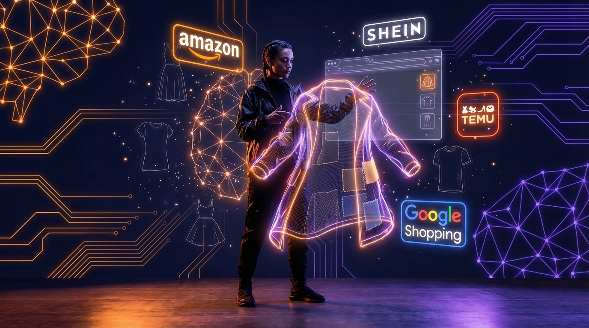
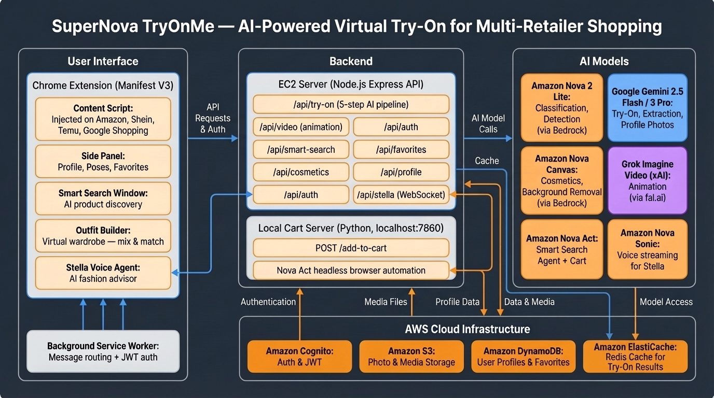

# SuperNova TryOnMe — AI-Powered Virtual Try-On for Online Shopping

## App Category

**AI-Powered Shopping & E-Commerce** — A Chrome Extension that brings virtual try-on technology to online shopping, enabling customers to see clothes, cosmetics, and accessories on their own body before purchasing.

---

## My Vision

Online shopping has a $40 billion problem: **70% of clothing returns** happen because items don't look as expected. Shoppers are forced to imagine how a garment will look on them based on a photo of a completely different person — a model with a different body type, skin tone, and style.

I envisioned a world where **every online shopper can try before they buy** — not through a separate app or a gimmicky AR filter, but right inside their browser, on the product page where they're already shopping. The experience should be as simple as clicking a button and seeing themselves wearing the product in seconds.

SuperNova TryOnMe makes this real. It's a Chrome Extension that injects a "Try It On" button directly onto product pages across Amazon, Shein, Temu, and Google Shopping. One click, and AI generates a photorealistic image of YOU wearing that exact garment — preserving your face, body, skin tone, and hair perfectly.

But I didn't stop at basic try-on. I wanted a **complete AI shopping companion**:
- A voice assistant (Stella) you can talk to hands-free while browsing
- An AI agent that searches products using natural language instead of keywords
- An outfit builder that lets you mix and match tops, bottoms, and shoes from different searches
- A smart cart that automatically adds your favorites to your shopping cart
- Cosmetics try-on with personalized color recommendations based on your skin undertone

The vision is simple: **AI should make online shopping feel like walking into a fitting room** — personalized, visual, and confidence-building.

---

## Why This Matters

### For Consumers
- **See it on YOU** — Not a model, not a mannequin. Your actual body, face, and skin tone wearing the product
- **Reduce returns** — Make informed purchase decisions by seeing the full picture before buying
- **Discover new styles** — AI-powered search and outfit building help explore fashion beyond keyword limits
- **Accessibility** — Voice-controlled shopping assistant for hands-free interaction

### For Retailers
- **Lower return rates** — Virtual try-on reduces the #1 cause of fashion returns (appearance mismatch)
- **Higher conversion** — Customers who see themselves in a product are more confident buyers
- **Cross-selling** — Outfit builder encourages multi-item purchases with complementary pieces
- **Engagement** — Video animation and voice interaction keep users in the shopping experience longer

### For the Industry
- Virtual try-on has historically required expensive body scanning, 3D garment modeling, and per-item setup. SuperNova TryOnMe uses **generative AI** to skip all of that — it works on any product image, from any retailer, with zero merchant integration. This democratizes virtual try-on for the entire e-commerce ecosystem.

---

## How I Built This

### Architecture Overview

SuperNova TryOnMe uses a **dual-server architecture** with a Chrome Extension frontend:

**Chrome Extension (Manifest V3)**
- Per-retailer content scripts inject "Try It On" buttons on Amazon, Shein, Temu, and Google Shopping product pages
- Background service worker handles authentication, message routing, and cross-origin image fetching
- Side panel popup provides profile management, pose selection, favorites, and the Stella voice agent

**EC2 Backend (Node.js Express)**
- Hosts all API endpoints: try-on, video generation, smart search, cosmetics, authentication, favorites, and profile management
- Stella voice agent runs over WebSocket with bidirectional audio streaming via Amazon Nova Sonic
- Connects to AWS services (Cognito, S3, DynamoDB, Bedrock) and external APIs (Gemini, fal.ai)

**Local Cart Server (Python)**
- Runs on the user's local machine where they're logged into Amazon
- Uses Amazon Nova Act to headlessly automate "Add to Cart" operations
- Transparent to the user — browser runs invisibly in the background

### The 5-Step AI Try-On Pipeline

Every try-on request goes through an intelligent pipeline:

1. **Product Classification** — Amazon Nova 2 Lite analyzes the product image and classifies it (upper body, lower body, full body, footwear, cosmetics, accessories with sub-types like earrings, necklaces, watches)
2. **Person Analysis** — Nova 2 Lite examines the user's photo to understand what they're currently wearing (separate top+bottom, dress, outerwear)
3. **Conflict Resolution** — The system determines the optimal try-on strategy. For example: if someone wearing a dress tries on pants, AI knows to remove the dress and generate a matching top
4. **Smart Prompt Engineering** — A context-aware prompt is built based on the garment type, current outfit, and any conflicts — different strategies for 20+ scenarios
5. **Image Generation** — Google Gemini 2.5 Flash Image (or Gemini 3 Pro for outfit mode) generates the final photorealistic try-on result with strict identity preservation

### Key Technical Challenges Solved

**Identity Preservation** — The hardest problem in virtual try-on. I use a combination of multi-image referencing (body + face close-ups), system instructions emphasizing identity fidelity, and strategic image ordering (identity images placed closest to the prompt for maximum weight).

**Outfit Conflict Resolution** — When garment types conflict (e.g., trying a skirt on someone wearing a jumpsuit), the system reasons about what to keep, what to remove, and what to generate as a complement. This required building a decision matrix across all possible garment × outfit combinations.

**Multi-Retailer Support** — Each e-commerce site has completely different DOM structures. I built a scraper adapter pattern where each site gets its own scraper file implementing a standard interface (`scrapeProductData()` + `scrapeCurrentImageUrl()`), while the content script remains site-agnostic.

**Voice Agent Architecture** — Stella uses Amazon Nova Sonic with tool-calling capability. The voice model can trigger actions (search, try-on, add to cart) mid-conversation through structured tool calls, creating a truly agentic voice experience.

### Tech Stack

| Layer | Technology |
|-------|-----------|
| Frontend | Chrome Extension (Manifest V3), Vanilla JS, CSS |
| Backend | Node.js, Express, Socket.IO |
| Authentication | Amazon Cognito (JWT) |
| Storage | Amazon S3, Amazon DynamoDB |
| AI Classification | Amazon Nova 2 Lite (via AWS Bedrock) |
| AI Try-On | Google Gemini 2.5 Flash Image, Gemini 3 Pro Image |
| AI Cosmetics | Amazon Nova Canvas (via AWS Bedrock) |
| AI Search | Amazon Nova Act (browser agent) |
| AI Voice | Amazon Nova Sonic (bidirectional streaming) |
| AI Cart | Amazon Nova Act (headless automation) |
| Video Generation | Grok Imagine Video via fal.ai |
| Infrastructure | AWS EC2, local Python server |

---

## Demo

### Virtual Try-On on Product Pages
Browse any product on Amazon, Shein, Temu, or Google Shopping. A "Try It On" button appears on the product image. Click it, and in seconds, see a photorealistic image of yourself wearing that exact garment.

### AI Smart Search
Type "blue summer dress" and an AI agent browses Amazon like a human — navigating pages, applying filters, scrolling results — and returns 20+ curated products, each with a try-on button.

### Outfit Builder
Describe your ideal outfit: "white crop top", "high-waisted black jeans", "white sneakers". AI searches for each piece in parallel, presents a visual wardrobe with hangers, and lets you mix and match. Try the complete outfit in a single AI call.

### Cosmetics Try-On
Select any cosmetic product (lipstick, eyeshadow, blush) and see it applied to your face. AI analyzes your skin tone and undertone to recommend the most flattering shades.

### Stella Voice Agent
Talk to Stella hands-free: "Find me a red dress for a party." She searches, presents results, and can try them on — all through voice conversation powered by Amazon Nova Sonic.

### Smart Cart
Select your favorite try-on results with checkboxes and click "Add to Shopping Cart." Nova Act automatically adds each item to your Amazon cart in the background — no manual clicking required.

---

## What I Learned

### AI Image Generation is Powerful but Demands Careful Engineering
Gemini's image generation capabilities are remarkable, but getting consistent, identity-preserving results required extensive prompt engineering. Small changes in prompt wording, image ordering, and system instructions dramatically affect output quality. The key insight: **place identity-critical images closest to the prompt** in the content array — the model weights later content more heavily.

### Agentic AI Changes Everything
Amazon Nova Act transformed what's possible. Instead of building traditional scrapers that break with every DOM change, I have an AI agent that browses the web like a human. The same approach powers the Smart Cart — Nova Act can navigate to a product page, select size/color options, and click "Add to Cart" without any site-specific code.

### Voice is the Next Interface
Building Stella with Amazon Nova Sonic revealed how natural voice interaction can be. The tool-calling architecture — where the voice model triggers structured actions mid-conversation — creates experiences that feel like talking to a knowledgeable shopping assistant. Bidirectional streaming means there's no awkward silence while waiting for responses.

### Conflict Resolution is an Underappreciated Problem
Most virtual try-on demos show a simple garment swap. But real shopping is complex: what happens when someone wearing a dress wants to try on a pair of jeans? You need to reason about clothing categories, remove the conflicting item, and generate a complementary piece. This outfit-aware intelligence is what separates a demo from a usable product.

### Multi-Retailer is Hard but Worth It
Each e-commerce site has its own DOM structure, image loading patterns, and product data format. Building the scraper adapter pattern was significant effort, but the result is an extension that works everywhere — not just on one platform. The key architectural decision: keep scrapers site-specific, keep everything else site-agnostic.

### The Local + Cloud Hybrid is Underexplored
Running Nova Act locally (for cart operations that need the user's Amazon login) while keeping the rest on EC2 was an unconventional but effective architecture. Some AI tasks genuinely need the user's local context (browser sessions, cookies) while others benefit from cloud scale. This hybrid approach deserves more attention in the developer community.

---

*Built with Amazon Nova (2 Lite, Canvas, Sonic, Act), Google Gemini (2.5 Flash, 3 Pro), Grok xAI Video, AWS (Bedrock, Cognito, S3, DynamoDB, EC2), and a lot of prompt engineering.*

*SuperNova TryOnMe — AI for Bharat Hackathon 2025*
